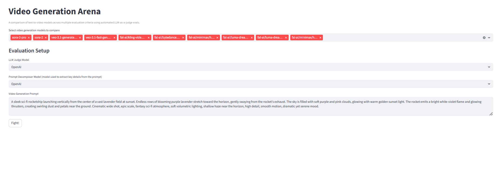
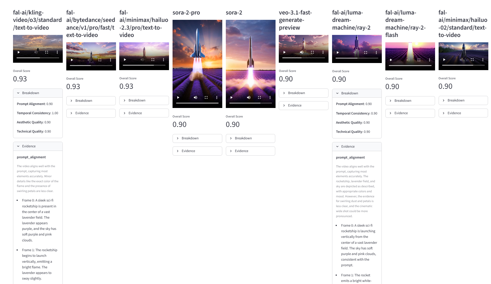

# Video Generation Arena

**LLM-as-a-Judge evaluation framework for text-to-video models**

Arena-style competitive benchmarking for video generation models using multi-criteria LLM-as-a-judge evaluation.




## Example

```python
import json
from video_judge import (
    VideoEvaluationOrchestrator,
    OpenAIJudge,
    VideoGenModelConfig,
    VideoGenArena,
    OpenAIDecomposer
)
from video_judge.config.logger import setup_default_logging
from datetime import datetime

setup_default_logging(level=20)
prompt = "A sleek sci-fi rocketship launching vertically from the center of a vast lavender field at sunset. Endless rows of blooming purple lavender stretch toward the horizon, gently swaying from the rocket’s exhaust. The sky is filled with soft purple and pink clouds, glowing with warm golden sunset light. The rocket emits a bright white-violet flame and glowing thrusters, creating swirling dust and petals near the ground. Cinematic wide shot, epic scale, fantasy sci-fi atmosphere, soft volumetric lighting, shallow haze near the horizon, high detail, smooth motion, dramatic yet serene mood."
with open("model_config.json", "r") as f:
    model_config_data = json.load(f)

decomposer = OpenAIDecomposer()
prompt_decomposition = decomposer.decompose(user_prompt=prompt)
judge = OpenAIJudge()

# configs = [VideoGenModelConfig(provider="openai", model_id="sora-2"), VideoGenModelConfig(
#     provider="fal", model_id="fal-ai/bytedance/seedance/v1/pro/fast/text-to-video")]
configs = [
    VideoGenModelConfig(provider=model_config["provider"], model_id=model_config["model_id"]) for model_config in model_config_data["models"]
]
arena = VideoGenArena(model_configs=configs, judge=judge)
result = arena.fight(video_gen_prompt=prompt,
                     prompt_decomposition=prompt_decomposition,
                     existing_video_path=None
                     )
with open(f"output/arena_report_{datetime.now().strftime('%Y%m%d_%H%M%S')}.json", "w") as f:
    f.write(result.model_dump_json(indent=2))
```

---

## Supported Models

### OpenAI

- `sora-2-pro` - Premium quality with synced audio
- `sora-2` - High quality, lower cost

### Google Veo

- `veo-3.1-generate-preview` - Advanced cinematic generation
- `veo-3.1-fast-generate-preview` - 2x faster, 70% cheaper

### FAL (ByteDance, Kuaishou, Luma, MiniMax)

- `fal-ai/kling-video/o3/standard/text-to-video` - Kling 3.0 multi-shot
- `fal-ai/bytedance/seedance/v1/pro/fast/text-to-video` - Seedance Pro Fast
- `fal-ai/minimax/hailuo-2.3/pro/text-to-video` - Hailuo 2.3 cinematic
- `fal-ai/luma-dream-machine/ray-2` - Luma Ray 2 motion

See `model_config.json` for full list and benchmark presets.

---

## Configuration

Create a `.env` file with your API keys:

```bash
# Required for video generation
OPENAI_API_KEY=your_key_here
GEMINI_API_KEY=your_key_here
FAL_KEY=your_key_here

# Optional for Claude judge/decomposer
ANTHROPIC_API_KEY=your_key_here
```

Model configuration in `model_config.json`:

```json
{
  "models": [
    {
      "provider": "google",
      "model_id": "veo-3.1-fast-generate-preview",
      "tier": "balanced"
    }
  ],
  "benchmark_configs": {
    "quick_benchmark": {
      "models": ["sora-2", "veo-3.1-fast", "seedance"]
    }
  }
}
```

---

## Evaluation Criteria

**Prompt Alignment (50% weight)** - Entities, actions, attributes match prompt
**Temporal Consistency (30% weight)** - Stable identity, no jumps or morphing
**Aesthetic Quality (10% weight)** - Composition, lighting, cinematography
**Technical Quality (10% weight)** - No artifacts, deformations, or glitches

Each criterion scored 0.0-1.0 with frame-level evidence and reasoning.

---

## Output Format

```json
{
  "prompt": "A rocket launching...",
  "results": [
    {
      "model": "veo-3.1-fast-generate-preview",
      "report": {
        "scores": {
          "prompt_alignment": 0.92,
          "temporal_consistency": 0.88,
          "aesthetic_quality": 0.85,
          "technical_quality": 0.9,
          "overall": 0.9
        },
        "details": [
          {
            "criteria": "prompt_alignment",
            "score": 0.92,
            "reasoning": "All entities present...",
            "evidence": [
              {
                "frame": 0,
                "timestamp": 0.0,
                "finding": "Rocket visible in center"
              }
            ]
          }
        ]
      }
    }
  ],
  "winner": "veo-3.1-fast-generate-preview",
  "rankings": ["veo-3.1-fast-generate-preview", "sora-2", "seedance"]
}
```

---
